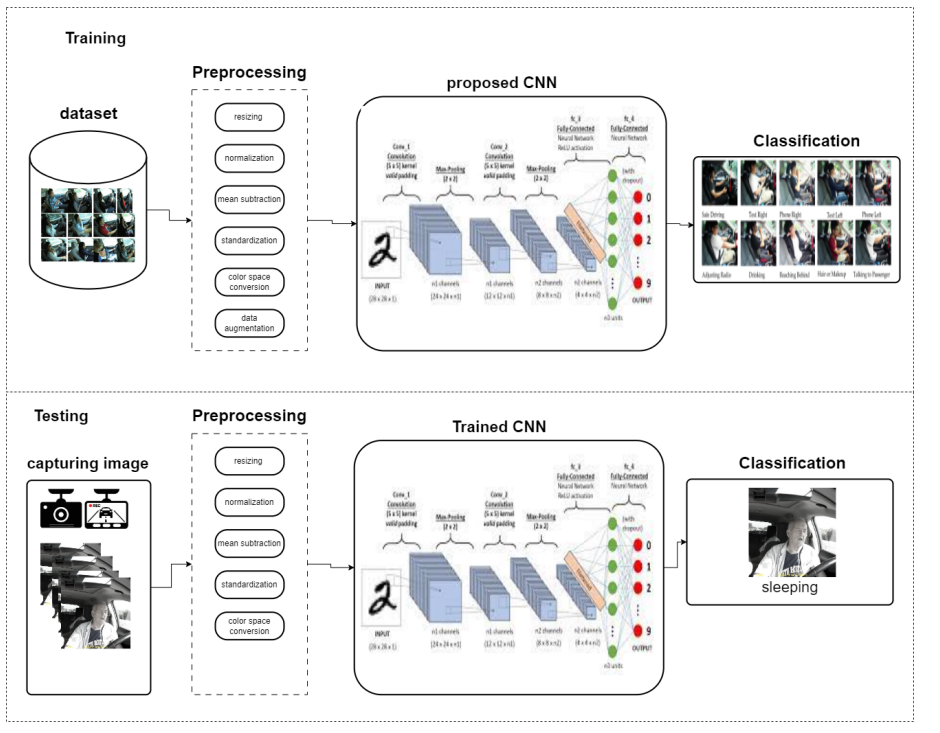

# Distracted Driver Detection using Deep Learning

This repository contains the implementation of a deep learning-based solution for detecting distracted drivers using computer vision techniques. The system achieves **97.8% accuracy** in classifying various driver distraction behaviors.

## Table of Contents
- [Problem Statement](#problem-statement)
- [Solution](#solution)
- [Dataset](#dataset)
- [Methodology](#methodology)
- [Results](#results)
- [Architecture Diagram](#architecture-diagram)

## Problem Statement
Distracted driving is a major cause of road accidents worldwide, resulting in thousands of fatalities annually. This project addresses the critical need for automated systems that can:
- Detect distracted driving behaviors in real-time
- Classify different types of distractions
- Potentially alert drivers to prevent accidents

## Solution
We developed a **YOLOv8-based convolutional neural network** that:
- Processes real-time dashcam footage
- Identifies 10 distinct distraction classes
- Achieves state-of-the-art accuracy through optimized hyperparameters

Key features:
- 97.8% classification accuracy
- Real-time processing capability
- Robust performance across lighting conditions

## Dataset
We used the [State Farm Distracted Driver Detection Dataset](https://www.kaggle.com/c/state-farm-distracted-driver-detection) containing:
- 22,424 training images
- 2,242 validation images
- 2,044 test images
- 10 distraction classes:

| Class | Description |
|-------|-------------|
| c0 | Safe driving |
| c1 | Texting - right |
| c2 | Talking on phone - right |
| c3 | Texting - left |
| c4 | Talking on phone - left |
| c5 | Operating radio |
| c6 | Drinking |
| c7 | Reaching behind |
| c8 | Hair and makeup |
| c9 | Talking to passenger |

## Methodology
Our approach combines:
1. **Image Preprocessing**:
   - Resizing (640x640px)
   - HSV augmentation
   - Mosaic and mixup data augmentation

2. **Model Architecture**:
   - YOLOv8 CNN backbone
   - Custom hyperparameter tuning
   - Transfer learning

3. **Optimization**:
   - Learning rate scheduling
   - Batch size optimization
   - Class merging strategy

## Results
Our optimized model achieved:

| Metric | Score |
|--------|-------|
| Accuracy | 97.8% |
| Precision | 98.2% |
| Recall | 97.5% |
| F1-Score | 97.8% |

Class-specific performance:

## Architecture Diagram

The diagram above illustrates our system architecture:
1. Input layer receiving dashcam footage
2. Preprocessing module
3. YOLOv8 backbone with feature extraction
4. Classification head with 10 output nodes
5. Post-processing for final prediction
